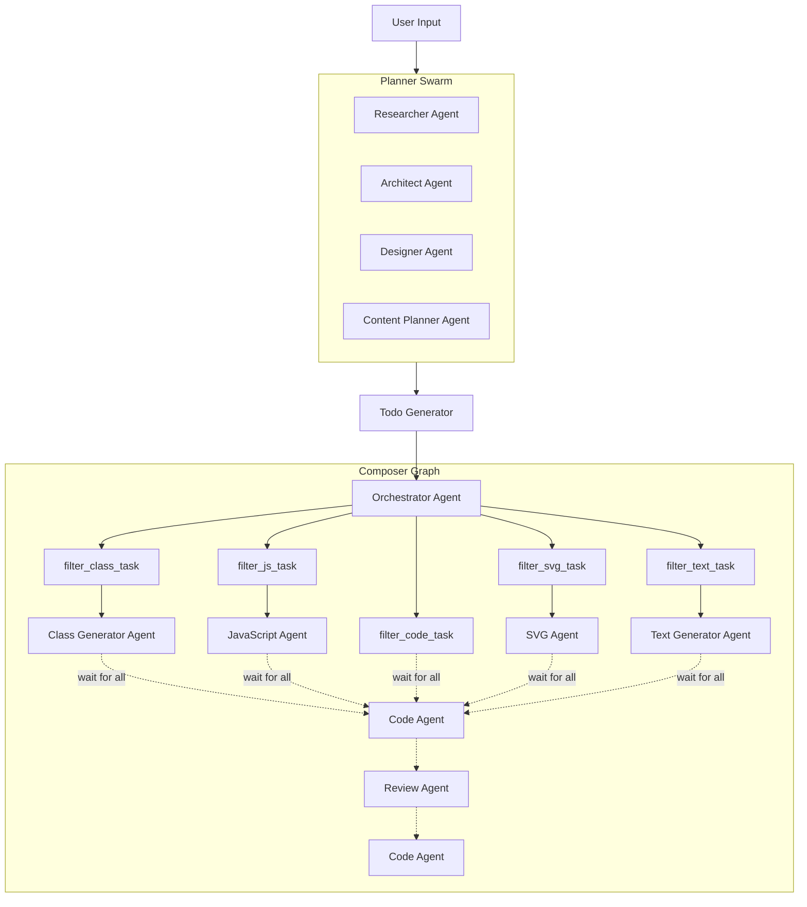

# 🍇 Grape Coder

Grape Coder is an AI-powered coding assistant built with the Strands Framework. It leverages a multi-agent system to plan, design, and generate code for web development projects using HTML/CSS/JS.

## Commands

Grape Coder provides several commands to interact with the AI agents:

- `grape-coder config`: Interactive configuration setup for providers and agents.
- `grape-coder mono-agent [PATH]`: Run a single coding agent with a prompt in the specified path (default: current directory).
- `grape-coder code [PATH]`: Start an interactive code session with file system tools in the specified path (default: current directory).
  - Options:
    - `--debug`: Enable debug mode with verbose output.
- `grape-coder --version`: Show the current version of Grape Coder.

## Installation

To install Grape Coder, ensure you have Python 3.13 or higher installed. You can install the package using `pip` or `uv`:

```bash
pip install grape-coder
```

Or with `uv`:

```bash
uv pip install grape-coder
```

## Config
Grape Coder uses a secure JSON configuration system supporting multiple AI providers through LiteLLM. Here is a simplified example of the configuration file:

```json
{
    "providers": {
        "Mistral": {
            "provider": "mistral",
            "api_key": "your-api-key",
            "api_base_url": null
        }
    },
    "agents": {
        "researcher": {
            "provider_ref": "Mistral",
            "model_name": "mistral-large-latest"
        },
        "code_agent": {
            "provider_ref": "Mistral",
            "model_name": "devstral-latest"
        }
    }
}
```
To update your configuration, run:

```bash
grape-coder config
```


## Development

### Project Structure

The project is structured as follows:

- `src/grape_coder/`: Main package source code.
  - `agents/`: Contains agent definitions (code, mono_agent, todo, etc.).
  - `composer/`: Logic for the composer graph (orchestrator, reviewers, generators).
  - `config/`: Configuration management (CLI, models, providers).
  - `display/`: UI and display utilities.
  - `nodes/`: Task filtering nodes.
  - `planner/`: Planner swarm agents (architect, designer, researcher, content planner).
  - `tools/`: Utility tools (web, work_path).
- `tests/`: Unit and integration tests.
- `pyproject.toml`: Project configuration and dependencies.

### Agent Description

Grape Coder employs a variety of specialized agents, each with a specific role in the development process:

#### Planner Swarm
- **Researcher**: Gathers context and requirements for the project.
- **Architect**: Defines the site structure and technical specifications.
- **Designer**: Establishes the visual identity, layout, and UI/UX guidelines.
- **Content Planner**: Structures the website's content and messaging.

#### Composer Graph
- **Todo Generator**: Breaks down the plan into actionable development tasks.
- **Orchestrator**: Coordinates the generation process, routing tasks to specialized agents.
- **Class Generator**: Generates CSS styles and classes.
- **JavaScript Agent**: Implements interactive functionality and logic.
- **SVG Agent**: Creates vector graphics and icons.
- **Text Generator**: Writes the textual content for the web pages.
- **Code Agent**: Assembles the final HTML structure and integrates all components.
- **Review Agent**: Validates the generated code and suggests improvements.

### Graph
The graph below illustrates the multi-agent architecture of Grape Coder, highlighting two of its core components: the Planner Swarm, which handles project planning, and the Composer Graph, which orchestrates code generation based on the planned tasks.


