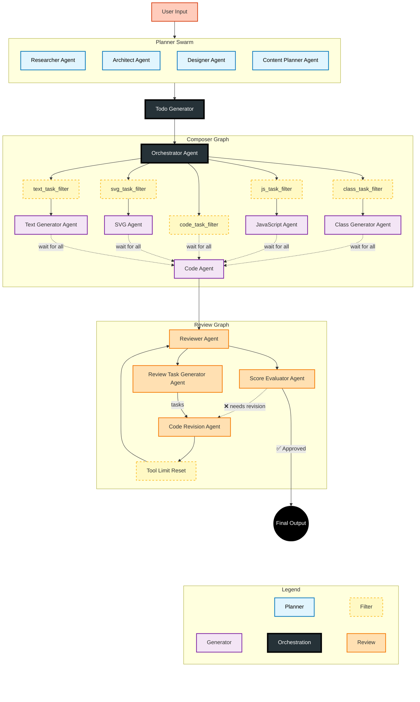

```mermaid
graph TD
    %% --- COLOR PALETTE ---
    classDef planner fill:#e1f5fe,stroke:#0277bd,stroke-width:2px,color:#000;
    classDef filter fill:#fff9c4,stroke:#fbc02d,stroke-width:2px,stroke-dasharray: 5 5;
    classDef generator fill:#f3e5f5,stroke:#7b1fa2,stroke-width:2px;
    classDef orchestrator fill:#263238,stroke:#000,stroke-width:4px,color:#fff;
    classDef userInput fill:#ffccbc,stroke:#d84315,stroke-width:2px;
    classDef reviewer fill:#ffe0b2,stroke:#f57c00,stroke-width:2px;
    classDef decision fill:#c8e6c9,stroke:#388e3c,stroke-width:2px;
    classDef endNode fill:#000,stroke:#000,color:#fff;
    classDef invisible fill:none,stroke:none,color:none;

    %% --- MAIN GRAPH ---
    User[User Input]:::userInput --> PlannerSwarm
    PlannerSwarm --> TodoGenerator[Todo Generator]:::orchestrator
    TodoGenerator --> Orchestrator

    subgraph PlannerSwarm["Planner Swarm"]
        direction TB
        Researcher[Researcher Agent]
        Architect[Architect Agent]
        Designer[Designer Agent]
        ContentPlanner[Content Planner Agent]
    end

    subgraph ComposerGraph["Composer Graph"]
        Orchestrator[Orchestrator Agent]:::orchestrator

        %% Filters
        ClassFilter[class_task_filter]
        JSFilter[js_task_filter]
        SVGFilter[svg_task_filter]
        TextFilter[text_task_filter]
        CodeFilter[code_task_filter]

        %% Agents
        ClassAgent[Class Generator Agent]
        JSAgent[JavaScript Agent]
        SVGAgent[SVG Agent]
        TextAgent[Text Generator Agent]
        CodeAgent[Code Agent]

        %% Links
        Orchestrator --> ClassFilter & JSFilter & SVGFilter & TextFilter & CodeFilter
        ClassFilter --> ClassAgent
        JSFilter --> JSAgent
        SVGFilter --> SVGAgent
        TextFilter --> TextAgent

        ClassAgent & JSAgent & CodeFilter & SVGAgent & TextAgent -.->|wait for all| CodeAgent
    end

    CodeAgent ---> Reviewer

    subgraph ReviewGraph["Review Graph"]
        direction TB
        ToolReset[Tool Limit Reset]
        Reviewer[Reviewer Agent]
        ScoreEvaluator[Score Evaluator Agent]
        TaskGenerator[Review Task Generator Agent]
        CodeRevision[Code Revision Agent]

        ToolReset --> Reviewer
        Reviewer --> ScoreEvaluator
        Reviewer --> TaskGenerator
        ScoreEvaluator -.->|❌ needs revision| CodeRevision
        TaskGenerator -- tasks --> CodeRevision
        CodeRevision --> ToolReset
    end

    ScoreEvaluator -- "✅ Approved" ----> FinalOutput((Final Output))

    %% --- APPLY CLASSES ---
    class Researcher,Architect,Designer,ContentPlanner planner;
    class ClassFilter,JSFilter,SVGFilter,TextFilter,CodeFilter,ToolReset filter;
    class ClassAgent,JSAgent,SVGAgent,TextAgent,CodeAgent generator;
    class Reviewer,ScoreEvaluator,TaskGenerator,CodeRevision reviewer;
    class QualityCheck decision;
    class FinalOutput endNode;

    %% --- CENTERED LEGEND ---
    %% Add invisible nodes to force centering
    InvisibleLeft[ ]:::invisible
    InvisibleRight[ ]:::invisible

    subgraph Legend["Legend"]
        direction LR
        L1[Planner]:::planner
        L2[Filter]:::filter
        L3[Generator]:::generator
        L5[Orchestration]:::orchestrator
        L6[Review]:::reviewer

        L1 ~~~ L2
        L3 ~~~ L5
        L5 ~~~ L6
    end

    %% Invisible links to enforce centered layout
    FinalOutput ~~~ InvisibleLeft
    InvisibleLeft ~~~ Legend
    Legend ~~~ InvisibleRight
```