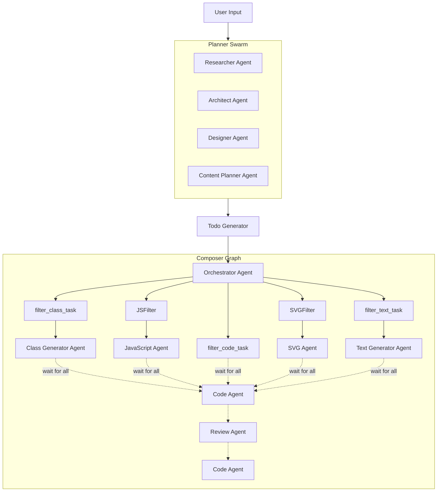

```mermaid
graph TD
    User[User Input] --> PlannerSwarm --> TodoGenerator[Todo Generator] --> Orchestrator
    
    subgraph PlannerSwarm["Planner Swarm"]
        Researcher[Researcher Agent]
        Architect[Architect Agent]
        Designer[Designer Agent]
        ContentPlanner[Content Planner Agent]
    end
    
    subgraph ComposerGraph["Composer Graph"]
        Orchestrator[Orchestrator Agent]
        ClassFilter[filter_class_task]
        TextFilter[filter_text_task]
        CodeFilter[filter_code_task]
        ClassAgent[Class Generator Agent]
        JSAgent[JavaScript Agent]
        SVGAgent[SVG Agent]
        TextAgent[Text Generator Agent]
        CodeAgent[Code Agent]
        CodeAgent2[Code Agent]
        ReviewAgent[Review Agent]
        
        Orchestrator --> ClassFilter
        Orchestrator --> JSFilter
        Orchestrator --> SVGFilter
        Orchestrator --> TextFilter
        Orchestrator --> CodeFilter
        ClassFilter --> ClassAgent
        JSFilter --> JSAgent
        SVGFilter --> SVGAgent
        TextFilter --> TextAgent
        ClassAgent -.->|wait for all| CodeAgent
        JSAgent -.->|wait for all| CodeAgent
        CodeFilter -.->|wait for all| CodeAgent
        SVGAgent -.->|wait for all| CodeAgent
        TextAgent -.->|wait for all| CodeAgent
        CodeAgent -.-> ReviewAgent
        ReviewAgent -.-> CodeAgent2
    end
```
