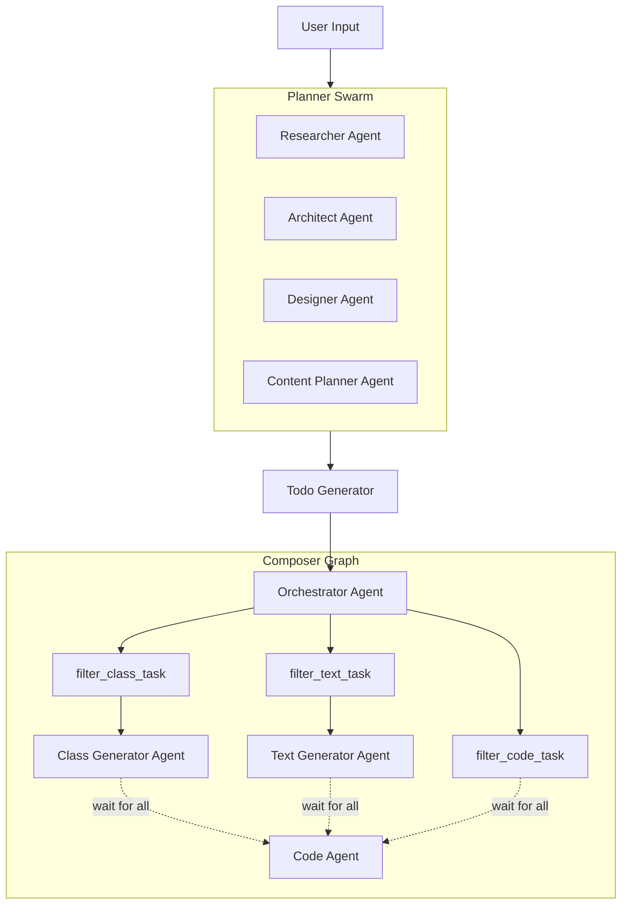

```mermaid
graph TD
    User[User Input] --> PlannerSwarm --> TodoGenerator[Todo Generator] --> Orchestrator
    
    subgraph PlannerSwarm["Planner Swarm"]
        Researcher[Researcher Agent]
        Architect[Architect Agent]
        Designer[Designer Agent]
        ContentPlanner[Content Planner Agent]
    end
    
    subgraph ComposerGraph["Composer Graph"]
        Orchestrator[Orchestrator Agent]
        ClassFilter[filter_class_task]
        TextFilter[filter_text_task]
        CodeFilter[filter_code_task]
        ClassAgent[Class Generator Agent]
        TextAgent[Text Generator Agent]
        CodeAgent[Code Agent]
        
        Orchestrator --> ClassFilter
        Orchestrator --> TextFilter
        Orchestrator --> CodeFilter
        ClassFilter --> ClassAgent
        TextFilter --> TextAgent
        ClassAgent -.->|wait for all| CodeAgent
        TextAgent -.->|wait for all| CodeAgent
        CodeFilter -.->|wait for all| CodeAgent
    end
```
